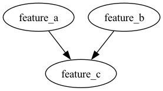

# Feature Fabrica

**Feature Fabrica** is an open-source Python library designed to improve engineering practices and transparency in feature engineering. It allows users to define features declaratively using YAML, manage dependencies between features, and apply complex transformations in a scalable and convenient manner.

## **Introduction**

In machine learning and data science, feature engineering plays a crucial role in building effective models. However, managing complex feature dependencies and transformations can be challenging. **Feature Fabrica** aims to simplify and streamline this process by providing a structured way to define, manage, and transform features.

With **Feature Fabrica**, you can:

- Define features declaratively using YAML.
- Manage dependencies between features automatically.
- Apply and chain transformations to compute derived features.
- Validate feature values using Pydantic.

**Key Features**

- **Declarative Feature Definitions**: Define features, data types, and dependencies using a simple YAML configuration.
- **Transformations**: Apply custom transformations to raw features to derive new features.
- **Dependency Management**: Automatically handle dependencies between features.
- **Pydantic Validation**: Ensure data types and values conform to expected formats.
- **Scalability**: Designed to scale from small projects to large machine learning pipelines.
- **Hydra Integration**: Leverage Hydra for configuration management, enabling flexible and dynamic configuration of transformations.

## **Quick Start**

### **Defining Features in YAML**

Features are defined in a YAML file. Here’s an example:

```yaml
# examples/basic_features.yaml
feature_a:
  description: "Raw feature A"
  data_type: "float"

feature_b:
  description: "Raw feature B"
  data_type: "float"

feature_c:
  description: "Derived feature C"
  data_type: "float"
  dependencies: ["feature_a", "feature_b"]
  transformation:
    sum_fn:
      _target_: feature_fabrica.transform.SumFn
      iterable: ["feature_a", "feature_b"]
    scale_feature:
      _target_: feature_fabrica.transform.ScaleFeature
      factor: 0.5

```

### **Creating and Using Transformations**

You can define custom transformations by subclassing the Transformation class:

```python
# transform.py
from feature_fabrica.core import Feature
from feature_fabrica.transform import Transformation


class SumFn(Transformation):
    def __init__(self, iterable: list[Any] | str):
        super().__init__()
        self.iterable = iterable

    def execute(self):
        return sum(self.iterable)


class ScaleFeature(Transformation):
    def __init__(self, factor: float):
        super().__init__()
        self.factor = factor

    def execute(self, data: float):
        return data * self.factor
```

### **Compiling and Executing Features**

To compile and execute features:

```python
from feature_fabrica.core import FeatureManager

data = {"feature_a": 10.0, "feature_b": 20.0}
feature_manager = FeatureManager(
    config_path="../examples", config_name="basic_features"
)
feature_manager.compile()
results = feature_manager.compute_all(data)
print(results["feature_c"])  # 0.5 * (10 + 20) = 15.0
print(results.feature_c)  # 0.5 * (10 + 20) = 15.0
```

### Visualize Features and Dependencies

```python
from feature_fabrica.core import FeatureManager

feature_manager = FeatureManager(
    config_path="../examples", config_name="basic_features"
)
feature_manager.compile()
feature_manager.get_visual_dependency_graph()
```



## **Contributing**

We welcome contributions! If you have ideas for improvements or want to report issues, feel free to open a pull request or an issue on GitHub.

**How to Contribute**

1. Fork the repository.
2. Create a new branch (git checkout -b feature/your-feature-name).
3. Commit your changes (git commit -m 'Add some feature').
4. Push to the branch (git push origin feature/your-feature-name).
5. Open a pull request.
